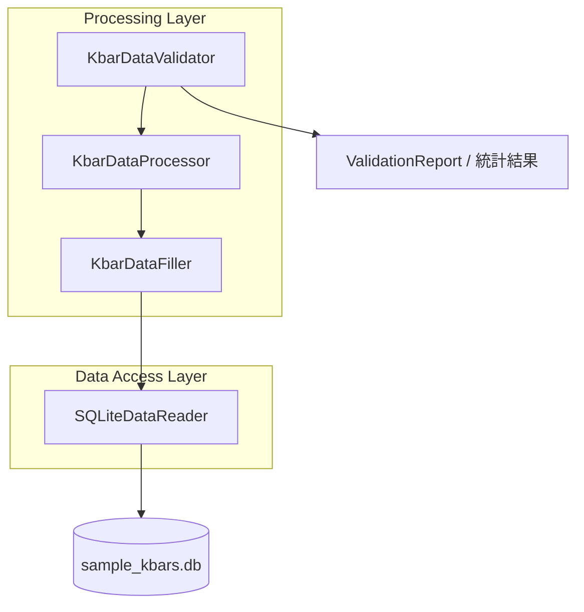

# 元件圖

```mermaid
graph TD
    subgraph Data Access Layer
        reader[SQLiteDataReader]
    end

    subgraph Processing Layer
        filler[KbarDataFiller]
        processor[KbarDataProcessor]
        validator[KbarDataValidator]
    end

    db[(sample_kbars.db)]
    report[ValidationReport / 統計結果]

    reader --> db
    filler --> reader
    processor --> filler
    validator --> processor
    validator --> report
```
