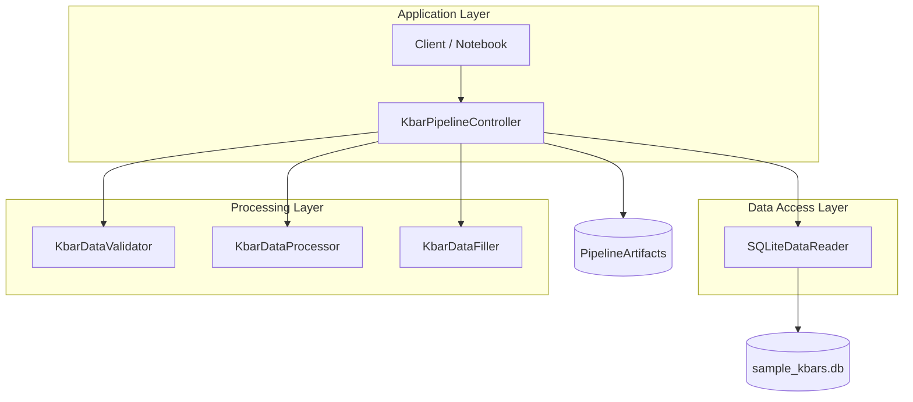

# 元件圖

```mermaid
graph TD
    subgraph Application Layer
        client[Client / Notebook]
        controller[KbarPipelineController]
    end

    subgraph Data Access Layer
        reader[SQLiteDataReader]
    end

    subgraph Processing Layer
        validator[KbarDataValidator]
        processor[KbarDataProcessor]
        filler[KbarDataFiller]
    end

    artifacts[(PipelineArtifacts)]
    db[(sample_kbars.db)]

    client --> controller
    controller --> reader
    reader --> db

    controller --> validator
    controller --> processor
    controller --> filler

    controller --> artifacts
```
