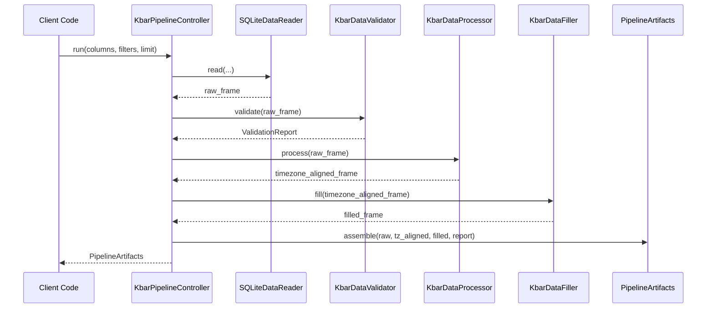

# 序列圖

```mermaid
sequenceDiagram
    participant Client as Client Code
    participant Controller as KbarPipelineController
    participant Reader as SQLiteDataReader
    participant Validator as KbarDataValidator
    participant Processor as KbarDataProcessor
    participant Filler as KbarDataFiller
    participant Artifacts as PipelineArtifacts

    Client->>Controller: run(columns, filters, limit)
    Controller->>Reader: read(...)
    Reader-->>Controller: raw_frame
    Controller->>Validator: validate(raw_frame)
    Validator-->>Controller: ValidationReport
    Controller->>Processor: process(raw_frame)
    Processor-->>Controller: timezone_aligned_frame
    Controller->>Filler: fill(timezone_aligned_frame)
    Filler-->>Controller: filled_frame
    Controller->>Artifacts: assemble(raw, tz_aligned, filled, report)
    Controller-->>Client: PipelineArtifacts
```
