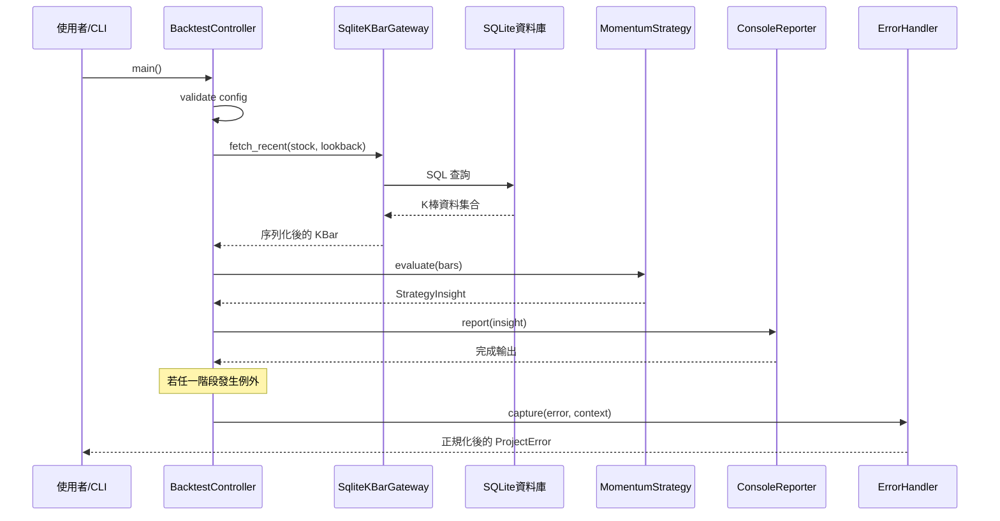

# 序列圖

描述 `run-controller` 指令從啟動到輸出結果的主要訊息流。

```mermaid
sequenceDiagram
    participant CLI as 使用者/CLI
    participant CTR as BacktestController
    participant GW as SqliteKBarGateway
    participant DB as SQLite資料庫
    participant STR as MomentumStrategy
    participant REP as ConsoleReporter
    participant ERR as ErrorHandler

    CLI->>CTR: main()
    CTR->>CTR: validate config
    CTR->>GW: fetch_recent(stock, lookback)
    GW->>DB: SQL 查詢
    DB-->>GW: K棒資料集合
    GW-->>CTR: 序列化後的 KBar
    CTR->>STR: evaluate(bars)
    STR-->>CTR: StrategyInsight
    CTR->>REP: report(insight)
    REP-->>CTR: 完成輸出
    Note over CTR: 若任一階段發生例外
    CTR->>ERR: capture(error, context)
    ERR-->>CLI: 正規化後的 ProjectError
```
