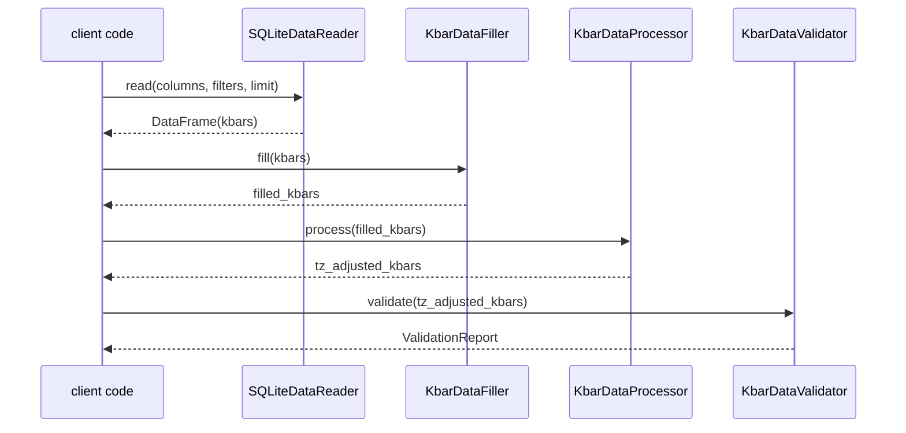

# 序列圖

```mermaid
sequenceDiagram
    participant App as client code
    participant Reader as SQLiteDataReader
    participant Filler as KbarDataFiller
    participant Processor as KbarDataProcessor
    participant Validator as KbarDataValidator

    App->>Reader: read(columns, filters, limit)
    Reader-->>App: DataFrame(kbars)
    App->>Filler: fill(kbars)
    Filler-->>App: filled_kbars
    App->>Processor: process(filled_kbars)
    Processor-->>App: tz_adjusted_kbars
    App->>Validator: validate(tz_adjusted_kbars)
    Validator-->>App: ValidationReport
```
