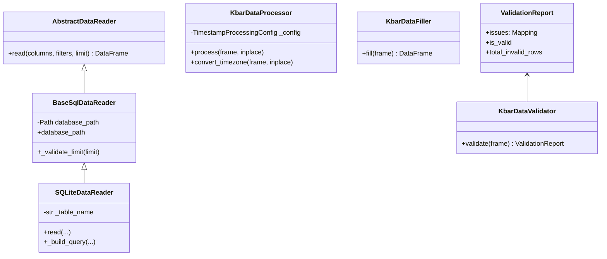

# 類別圖

```mermaid
classDiagram
    class AbstractDataReader {
        +read(columns, filters, limit) DataFrame
    }

    class BaseSqlDataReader {
        -Path database_path
        +database_path
        +_validate_limit(limit)
    }

    class SQLiteDataReader {
        -str _table_name
        +read(...)
        +_build_query(...)
    }

    class KbarDataProcessor {
        -TimestampProcessingConfig _config
        +process(frame, inplace)
        +convert_timezone(frame, inplace)
    }

    class KbarDataValidator {
        +validate(frame) ValidationReport
    }

    class KbarDataFiller {
        +fill(frame) DataFrame
    }

    class ValidationReport {
        +issues: Mapping
        +is_valid
        +total_invalid_rows
    }

    AbstractDataReader <|-- BaseSqlDataReader
    BaseSqlDataReader <|-- SQLiteDataReader
    ValidationReport <-- KbarDataValidator
```
