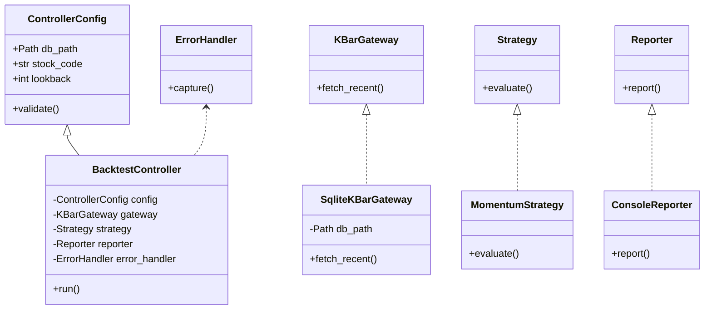

# 類別圖

下圖描述目前系統中的核心類別與其責任界線，所有類別名稱皆呼應程式碼實作。

```mermaid
classDiagram
    ControllerConfig <|-- BacktestController
    KBarGateway <|.. SqliteKBarGateway
    Strategy <|.. MomentumStrategy
    Reporter <|.. ConsoleReporter
    ErrorHandler <.. BacktestController

    class ControllerConfig {
        +Path db_path
        +str stock_code
        +int lookback
        +validate()
    }

    class BacktestController {
        -ControllerConfig config
        -KBarGateway gateway
        -Strategy strategy
        -Reporter reporter
        -ErrorHandler error_handler
        +run()
    }

    class KBarGateway {
        +fetch_recent()
    }

    class SqliteKBarGateway {
        -Path db_path
        +fetch_recent()
    }

    class Strategy {
        +evaluate()
    }

    class MomentumStrategy {
        +evaluate()
    }

    class Reporter {
        +report()
    }

    class ConsoleReporter {
        +report()
    }

    class ErrorHandler {
        +capture()
    }
```
